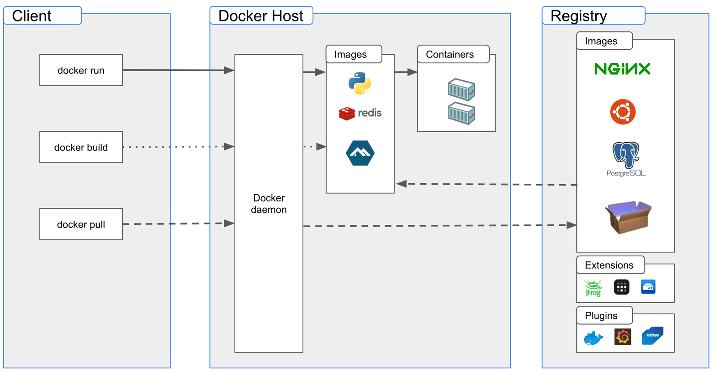

<!-- .slide: data-background="#5499a8" -->

---

## Inside Docker

Philippe Vlérick

---

## Agenda

- Introduction
- _Containers_ at a Glance
- Docker
- Windows _Containers_

--

_Slides to a minimum, demos to a maximum_

---

## Introduction

--

_Containers_ Everywhere

 <!-- .element height="75%" width="75%" -->

--

Docker is the most popular tool

 <!-- .element height="25%" width="25%" -->

--

I like details :-)

---

## _Containers_ at a Glance

--

### What is a _Container_?

--

It looks like a _VM_...

--

But it's not a _VM_!
- shares the _host_'s kernel
- cannot run a different OS

--

- See from the _host_, it's only a group of processes
- A _VM_ is opaque

--

#### OS Level Vritualization

- Resource constraints
  - CPU, memory, network...
- Security constraints
  - What it an see, what it can do...

--

> An environment for executing processes with configurable isolation and resource limitations

<small>https://github.com/opencontainers/runtime-spec/blob/main/glossary.md</small>

--

> The goal of a Standard Container is to encapsulate a software component and all its dependencies in a format that is self-describing and portable

<small>https://github.com/opencontainers/runtime-spec/blob/main/principles.md</small>

--

### TL;DR

an isolated box where one or more processes are executed

--

### Demos: A _Container_ and its _Host_

---

## Docker

--

### Architecture

 <!-- .element height="80%" width="80%" -->

--

### Architecture

- client/server
  - CLI: _docker_
  - Server: _dockerd_
- REST API

--

### Demo: _docker_ CLI

--

### Process

 <!-- .element height="40%" width="40%" -->

--

### Demo: Creating a Container

Note: docker run & snap_ps

--

### _runc_
<small>https://github.com/opencontainers/runc</small>

- _OCI Container Runtime_
- https://github.com/opencontainers/runtime-spec/blob/main/runtime.md
- Alternative: _crun_

--

### Demo: _runc_

--

### _shim_

- Starts _runc_
- Reports _container_ state to _containerd_
- STDIN & STDOUT

--

### Demo: _shim_

--

### _containerd_

<small>https://github.com/containerd/containerd</small>

- _Container Runtime_
- Prepares the _bundle_ required by the _OCI Container Runtime_
  - creates the _config.json_ file
  - configures/mounts the _rootfs_
- Manages the _containers_ lifetime
- "Alternative": CRI-O

--

### Demo: _containerd_

--

## _Moby_

--

- Open-Source blocks extracted from _docker_
  - result from re-architecuring of _docker_ in smaller components
  - neutrals

---

## Windows _Containers_

--

Two isolation types
- _process_
  - kernel level isolation (just like with Linux)
- _hyperv_
  - one VM for each _container_
  - no explicit management of the _VM_

--

### Demo: _hyperv_ Containers

---

## Conclusions
