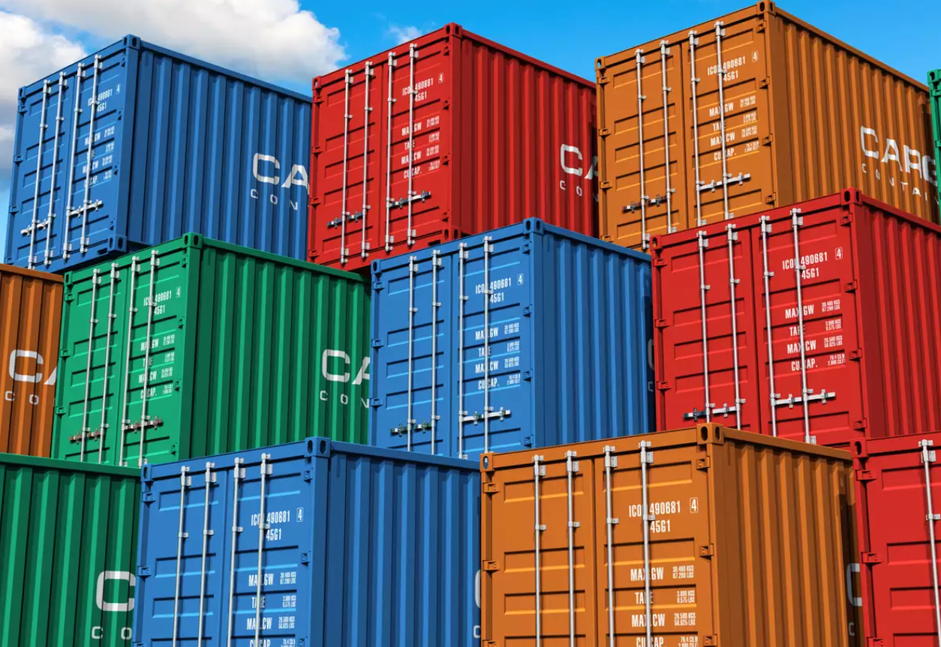

<!-- .slide: data-background="#5499a8" -->

---

## Les dessous de Docker

Philippe Vlérick

---

## Agenda

- Introduction
- Les _containers_ en bref
- Docker
- _Containers_ Linux
- _Containers_ Windows

--

_Un minimum de slides, un maximum de démos_

---

## Introduction

--

Des _containers_ partout

 <!-- .element height="50%" width="50%" -->

Note: qui utilise des containers régulièrement?

--

Docker est l'outil le plus populaire

 <!-- .element height="25%" width="25%" -->

--

J'aime bien les détails :-)

---

## Les _containers_ en bref

--

### Qu'est-ce qu'un _container_?

--

Ca ressemble à une _VM_...

--

Mais ce n'est pas une _VM_!
- partage le noyeau du _host_
- ne peut pas utiliser un OS différent

--

- Pour le _host_, ce n'est qu'un groupe de processus
- Un _VM_, elle, est opaque

--

### Virtualisation au niveau du système d'exploitation

- Limitation des resources utilisables
- Limitation de ce qui est vu

--

### Demo 1: un _container_ et son _host_

---

## Docker

--

### Historique

- 

--

### Quelques définitions

- _Image_: 
- _Container_: 

---

## Les containers Linux

---

## Les containers Windows

---

## Conclusions

---

## Questions?
