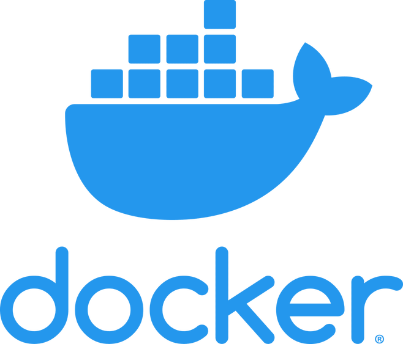
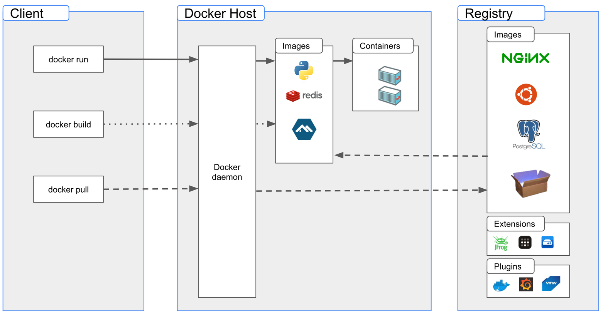
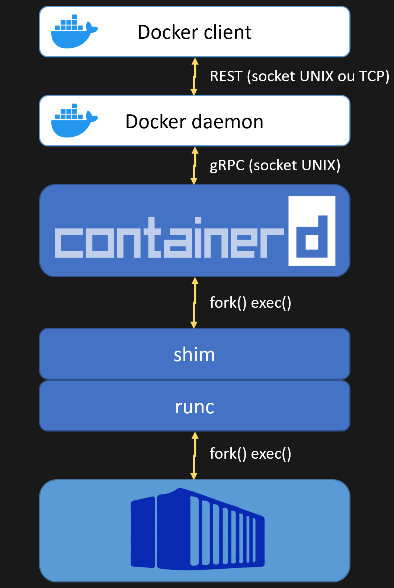

<!-- .slide: data-background="#5499a8" -->

---

## Les dessous de Docker

Philippe Vlérick

---

## Agenda

- Introduction
- Les _containers_ en bref
- Docker
- _Containers_ Linux
- _Containers_ Windows

--

_Un minimum de slides, un maximum de démos_

---

## Introduction

--

Des _containers_ partout

 <!-- .element height="75%" width="75%" -->

Note: qui utilise des containers régulièrement?

--

Docker est l'outil le plus populaire

 <!-- .element height="25%" width="25%" -->

--

J'aime bien les détails :-)

---

## Les _containers_ en bref

--

### Qu'est-ce qu'un _container_?

--

Ca ressemble à une _VM_...

--

Mais ce n'est pas une _VM_!
- partage le noyeau du _host_
- ne peut pas utiliser un OS différent

--

- Pour le _host_, ce n'est qu'un groupe de processus
- Un _VM_, elle, est opaque

--

#### Virtualisation au niveau du système d'exploitation

- Contraintes des resources
  - CPU, mémoire, réseau...
- Contraintes de sécurité
  - Ce qu'il peut voir, faire...

--

> An environment for executing processes with configurable isolation and resource limitations

<small>https://github.com/opencontainers/runtime-spec/blob/main/glossary.md</small>

--

> The goal of a Standard Container is to encapsulate a software component and all its dependencies in a format that is self-describing and portable

<small>https://github.com/opencontainers/runtime-spec/blob/main/principles.md</small>

--

### TL;DR

une boîte isolée ou s'executent un ou plusieurs processus

--

### Demos: un _container_ et son _host_

---

## Docker

--

### Architecture

 <!-- .element height="80%" width="80%" -->

--

### Architecture

- client/server
  - CLI: _docker_
  - Server: _dockerd_
- REST API

--

### Demo: _docker_ CLI

--

### Processus

 <!-- .element height="40%" width="40%" -->

--

### Demo: création d'un container

Note: docker run & snap_ps

--

### _runc_
<small>https://github.com/opencontainers/runc</small>

- _OCI Container Runtime_
- https://github.com/opencontainers/runtime-spec/blob/main/runtime.md
- Alternative: _crun_

--

### Demo: _runc_ & _crun_

--

### _shim_

- Démarre _runc_
- Rapporte l'état à _containerd_

--

### Demo: _shim_

--

### _containerd_

<small>https://github.com/containerd/containerd</small>

- _Container Runtime_
- Prépare le _bundle_ requis par l'_OCI Container Runtime_
  - creer le fichier _config.json_
  - configurer/monter le _rootfs_
- Gère le cycle de vie des _containers_
- "Alternative": CRI-O

--

### Demo: _containerd_

--

## _Moby_

--

- Blocs open-source extraits de _docker_
  - résultat de l'éclatement de _docker_ en plus petits composants
  - neutres

---

## Les containers Windows

--

Deux types d'isolation
- _process_
  - isolation au niveau du noyau
- _hyperv_
  - une VM par _container_
  - pas de gestion explicite

--

### Demo: containers _process_

--

### Demo: containers _hyperv_

---

## Conclusions

---

